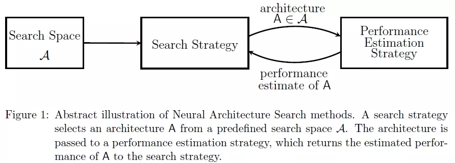

# NAS

Neural Architecture Search（NAS），即神经网络结构搜索技术，通过某种结构及算法，实现神经网络结构的自动生成，它主要包含**搜索空间**，以及**搜索策略**、**性能评估策略**等几个维度的知识。


### 1. 搜索空间

可以简单理解为基于一定的前提和假设，并根据已有的经验，预置一些网络结构单元，就像堆积木一样，预先提供了各种各样的积木，最终的网络结构就是通过搜索空间中的这些原始积木组合成的。

```bash
绝大部分机器学习都不是人工智能，计算机并不是真的具有智能了，也不会无缘无故获得既定目标以外的能力
```


