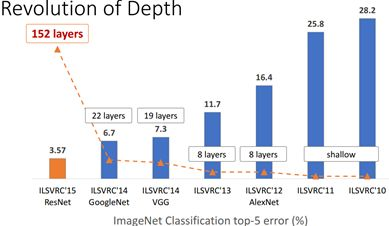
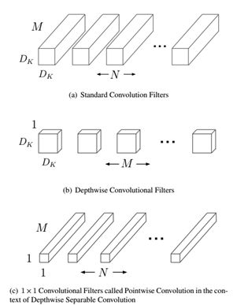
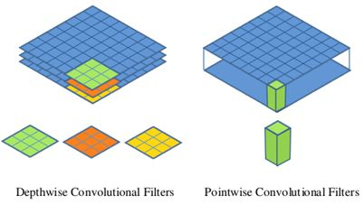
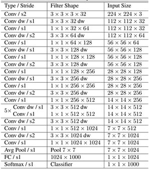
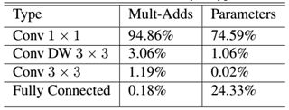
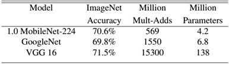

## 引言

卷积神经网络（CNN）已经普遍应用在计算机视觉领域，并且已经取得了不错的效果。图1为近几年来CNN在ImageNet竞赛的表现，可以看到为了追求分类准确度，模型深度越来越深，模型复杂度也越来越高，如深度残差网络（ResNet）其层数已经多达152层。



<div align=center>图1 CNN在ImageNet上的表现（来源：CVPR2017）</div>

然而，在某些真实的应用场景如移动或者嵌入式设备，如此大而复杂的模型是难以被应用的。首先是模型过于庞大，面临着内存不足的问题，其次这些场景要求低延迟，或者说响应速度要快，想象一下自动驾驶汽车的行人检测系统如果速度很慢会发生什么可怕的事情。所以，研究小而高效的CNN模型在这些场景至关重要，至少目前是这样，尽管未来硬件也会越来越快。目前的研究总结来看分为两个方向：一是对训练好的复杂模型进行压缩得到小模型；二是直接设计小模型并进行训练。不管如何，其目标在保持模型性能（accuracy）的前提下降低模型大小（parameters size），同时提升模型速度（speed, low latency）。本文的主角MobileNet属于后者，其是Google最近提出的一种小巧而高效的CNN模型，其在accuracy和latency之间做了折中。下面对MobileNet做详细的介绍。

## Depthwise separable convolution

MobileNet的基本单元是深度级可分离卷积（depthwise separable convolution），其实这种结构之前已经被使用在Inception模型中。深度级可分离卷积其实是一种可分解卷积操作（factorized convolutions），其可以分解为两个更小的操作：depthwise convolution和pointwise convolution，如图1所示。Depthwise convolution和标准卷积不同，对于标准卷积其卷积核是用在所有的输入通道上（input channels），而depthwise convolution针对每个输入通道采用不同的卷积核，就是说一个卷积核对应一个输入通道，所以说depthwise convolution是depth级别的操作。而pointwise convolution其实就是普通的卷积，只不过其采用1x1的卷积核。图2中更清晰地展示了两种操作。对于depthwise separable convolution，其首先是采用depthwise convolution对不同输入通道分别进行卷积，然后采用pointwise convolution将上面的输出再进行结合，这样其实整体效果和一个标准卷积是差不多的，但是会大大减少计算量和模型参数量。



<div align=center>图1 Depthwise separable convolution</div>




<div align=center>图2 Depthwise convolution和pointwise convolution</div>

这里简单分析一下depthwise separable convolution在计算量上与标准卷积的差别。假定输入特征图大小是  ，而输出特征图大小是  ，其中  是特征图的width和height，这是假定两者是相同的，而和指的是通道数（channels or depth）。这里也假定输入与输出特征图大小（width and height）是一致的。采用的卷积核大小是尽管是特例，但是不影响下面分析的一般性。对于标准的卷积  ，其计算量将是：


而对于depthwise convolution其计算量为：  ，pointwise convolution计算量是：  ，所以depthwise separable convolution总计算量是：


可以比较depthwise separable convolution和标准卷积如下：


一般情况下  比较大，那么如果采用3x3卷积核的话，depthwise separable convolution相较标准卷积可以降低大约9倍的计算量。其实，后面会有对比，参数量也会减少很多。

## MobileNet网络结构

前面讲述了depthwise separable convolution，这是MobileNet的基本组件，但是在真正应用中会加入batchnorm，并使用ReLU激活函数，所以depthwise separable convolution的基本结构如图3所示。


<div align=center>图3 加入BN和ReLU的depthwise separable convolution</div>

MobileNet的网络结构如表1所示。首先是一个3x3的标准卷积，然后后面就是堆积depthwise separable convolution，并且可以看到其中的部分depthwise convolution会通过strides=2进行down sampling。然后采用average pooling将feature变成1x1，根据预测类别大小加上全连接层，最后是一个softmax层。如果单独计算depthwise
convolution和pointwise convolution，整个网络有28层（这里Avg Pool和Softmax不计算在内）。我们还可以分析整个网络的参数和计算量分布，如表2所示。可以看到整个计算量基本集中在1x1卷积上，如果你熟悉卷积底层实现的话，你应该知道卷积一般通过一种im2col方式实现，其需要内存重组，但是当卷积核为1x1时，其实就不需要这种操作了，底层可以有更快的实现。对于参数也主要集中在1x1卷积，除此之外还有就是全连接层占了一部分参数。



<div align=center>表1 MobileNet的网络结构</div>



<div align=center>表2 MobileNet网络的计算与参数分布</div>

MobileNet到底效果如何，这里与GoogleNet和VGG16做了对比，如表3所示。相比VGG16，MobileNet的准确度稍微下降，但是优于GoogleNet。然而，从计算量和参数量上MobileNet具有绝对的优势。



<div align=center>表3 MobileNet与GoogleNet和VGG16性能对比</div>

## MobileNet瘦身

前面说的MobileNet的基准模型，但是有时候你需要更小的模型，那么就要对MobileNet瘦身了。这里引入了两个超参数：width multiplier和resolution multiplier。第一个参数width multiplier主要是按比例减少通道数，该参数记为  ，其取值范围为(0,1]，那么输入与输出通道数将变成  和  ，对于depthwise separable convolution，其计算量变为：


因为主要计算量在后一项，所以width multiplier可以按照比例降低计算量，其是参数量也会下降。第二个参数resolution multiplier主要是按比例降低特征图的大小，记为  ，比如原来输入特征图是224x224，可以减少为192x192，加上resolution multiplier，depthwise separable convolution的计算量为：


要说明的是，resolution multiplier仅仅影响计算量，但是不改变参数量。引入两个参数会给肯定会降低MobileNet的性能，具体实验分析可以见paper，总结来看是在accuracy和computation，以及accuracy和model size之间做折中。

## MobileNet的TensorFlow实现

TensorFlow的nn库有depthwise convolution算子tf.nn.depthwise_conv2d，所以MobileNet很容易在TensorFlow上实现：

```python
class MobileNet(object):
    def __init__(self, inputs, num_classes=1000, is_training=True,
                 width_multiplier=1, scope="MobileNet"):
        """
        The implement of MobileNet(ref:https://arxiv.org/abs/1704.04861)
        :param inputs: 4-D Tensor of [batch_size, height, width, channels]
        :param num_classes: number of classes
        :param is_training: Boolean, whether or not the model is training
        :param width_multiplier: float, controls the size of model
        :param scope: Optional scope for variables
        """
        self.inputs = inputs
        self.num_classes = num_classes
        self.is_training = is_training
        self.width_multiplier = width_multiplier

        # construct model
        with tf.variable_scope(scope):
            # conv1
            net = conv2d(inputs, "conv_1", round(32 * width_multiplier), filter_size=3,
                         strides=2)  # ->[N, 112, 112, 32]
            net = tf.nn.relu(bacthnorm(net, "conv_1/bn", is_training=self.is_training))
            net = self._depthwise_separable_conv2d(net, 64, self.width_multiplier,
                                "ds_conv_2") # ->[N, 112, 112, 64]
            net = self._depthwise_separable_conv2d(net, 128, self.width_multiplier,
                                "ds_conv_3", downsample=True) # ->[N, 56, 56, 128]
            net = self._depthwise_separable_conv2d(net, 128, self.width_multiplier,
                                "ds_conv_4") # ->[N, 56, 56, 128]
            net = self._depthwise_separable_conv2d(net, 256, self.width_multiplier,
                                "ds_conv_5", downsample=True) # ->[N, 28, 28, 256]
            net = self._depthwise_separable_conv2d(net, 256, self.width_multiplier,
                                "ds_conv_6") # ->[N, 28, 28, 256]
            net = self._depthwise_separable_conv2d(net, 512, self.width_multiplier,
                                "ds_conv_7", downsample=True) # ->[N, 14, 14, 512]
            net = self._depthwise_separable_conv2d(net, 512, self.width_multiplier,
                                "ds_conv_8") # ->[N, 14, 14, 512]
            net = self._depthwise_separable_conv2d(net, 512, self.width_multiplier,
                                "ds_conv_9")  # ->[N, 14, 14, 512]
            net = self._depthwise_separable_conv2d(net, 512, self.width_multiplier,
                                "ds_conv_10")  # ->[N, 14, 14, 512]
            net = self._depthwise_separable_conv2d(net, 512, self.width_multiplier,
                                "ds_conv_11")  # ->[N, 14, 14, 512]
            net = self._depthwise_separable_conv2d(net, 512, self.width_multiplier,
                                "ds_conv_12")  # ->[N, 14, 14, 512]
            net = self._depthwise_separable_conv2d(net, 1024, self.width_multiplier,
                                "ds_conv_13", downsample=True) # ->[N, 7, 7, 1024]
            net = self._depthwise_separable_conv2d(net, 1024, self.width_multiplier,
                                "ds_conv_14") # ->[N, 7, 7, 1024]
            net = avg_pool(net, 7, "avg_pool_15")
            net = tf.squeeze(net, [1, 2], name="SpatialSqueeze")
            self.logits = fc(net, self.num_classes, "fc_16")
            self.predictions = tf.nn.softmax(self.logits)

    def _depthwise_separable_conv2d(self, inputs, num_filters, width_multiplier,
                                    scope, downsample=False):
        """depthwise separable convolution 2D function"""
        num_filters = round(num_filters * width_multiplier)
        strides = 2 if downsample else 1

        with tf.variable_scope(scope):
            # depthwise conv2d
            dw_conv = depthwise_conv2d(inputs, "depthwise_conv", strides=strides)
            # batchnorm
            bn = bacthnorm(dw_conv, "dw_bn", is_training=self.is_training)
            # relu
            relu = tf.nn.relu(bn)
            # pointwise conv2d (1x1)
            pw_conv = conv2d(relu, "pointwise_conv", num_filters)
            # bn
            bn = bacthnorm(pw_conv, "pw_bn", is_training=self.is_training)
            return tf.nn.relu(bn)
```

完整实现可以参见[GitHub](https://link.zhihu.com/?target=https%3A//github.com/xiaohu2015/DeepLearning_tutorials/)。

## 总结

本文简单介绍了Google提出的移动端模型MobileNet，其核心是采用了可分解的depthwise separable convolution，其不仅可以降低模型计算复杂度，而且可以大大降低模型大小。在真实的移动端应用场景，像MobileNet这样类似的网络将是持续研究的重点。后面我们会介绍其他的移动端CNN模型。

## 参考资料

1. [MobileNets: Efficient Convolutional Neural Networks for Mobile Vision Application](https://link.zhihu.com/?target=https%3A//arxiv.org/abs/1704.04861)

**欢迎交流与转载，文章会同步发布在公众号：机器学习算法全栈工程师(Jeemy110):**

[http://weixin.qq.com/r/ISo1LTXEsmjNrXFO938z](https://link.zhihu.com/?target=http%3A//weixin.qq.com/r/ISo1LTXEsmjNrXFO938z) (二维码自动识别)


编辑于 2017-12-03