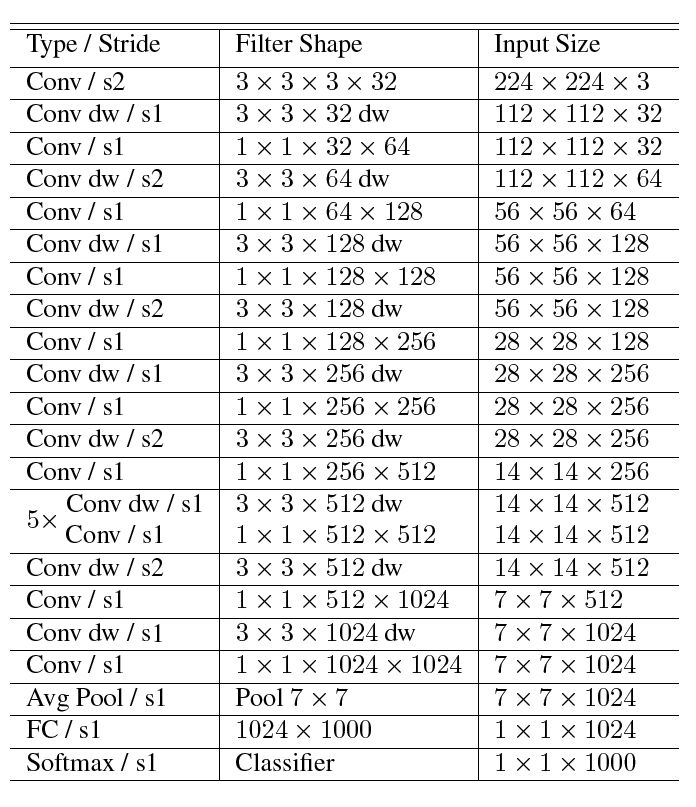

# MobileNet v2

---

几天前，著名的小网 MobileNet 迎来了它的升级版：[MobileNet V2](https://link.zhihu.com/?target=https%3A//128.84.21.199/pdf/1801.04381.pdf)。之前用过 [MobileNet V1](https://link.zhihu.com/?target=https%3A//arxiv.org/pdf/1704.04861.pdf)的准确率不错，更重要的是速度很快，在 Jetson TX2 上都能达到 38 FPS 的帧率，因此对于 V2 的潜在提升更是十分期待。

**V2 主要引入了两个改动：Linear Bottleneck 和 Inverted Residual Blocks**。下面让我们通过对比 V2 与 V1 和 ResNet 结构，来认识这两个改动背后的动机和细节。欢迎大家指正。

更新：2018年4月2日，Google发布了MobileNet V2的官方实现，原论文在Arxiv上也做出了相应更新，详见[官方博客](https://link.zhihu.com/?target=https%3A//research.googleblog.com/2018/04/mobilenetv2-next-generation-of-on.html)。

------

## **1. 对比 MobileNet V1 与 V2 的微结构**

![ \begin{aligned} \textbf{MobileNet V1} \quad\quad\quad\quad\quad\quad\quad\quad~~ \xrightarrow{\quad \quad} \quad \begin{matrix} 3 \times 3 \\[1ex] \textbf{DW} \end{matrix} \quad \xrightarrow{~ ReLU6 ~} \quad \begin{matrix} 1 \times 1 \\[1ex] \textbf{PW} \end{matrix} \quad \xrightarrow{\color{blue}{~ ReLU6 ~}} \\[5ex] \textbf{MobileNet V2} ~~ \xrightarrow{\quad \quad} \quad \begin{matrix} \color{red}{1 \times 1} \\[1ex] \color{red}{\textbf{PW}} \end{matrix} \quad {\color{red}{\xrightarrow{~ ReLU6 ~}}} \quad \begin{matrix} 3 \times 3 \\[1ex] \textbf{DW} \end{matrix} \quad \xrightarrow{~ ReLU6 ~} \quad \begin{matrix} 1 \times 1 \\[1ex] \textbf{PW} \end{matrix} \quad \xrightarrow{\color{red}{~Linear~}} \end{aligned}](mobilenetv2.assets/equation-1554954975316.svg)

> **相同点**

- **都采用 Depth-wise (DW) 卷积搭配 Point-wise (PW) 卷积的方式来提特征。**这两个操作合起来也被称为 Depth-wise Separable Convolution，之前在 Xception 中被广泛使用。这么做的好处是理论上可以成倍的减少卷积层的时间复杂度和空间复杂度。由下式可知，因为卷积核的尺寸  通常远小于输出通道数 ，因此标准卷积的计算复杂度近似为 DW + PW 组合卷积的  倍。

> **不同点：Linear Bottleneck**

- **V2 在 DW 卷积之前新加了一个 PW 卷积**。这么做的原因，是因为 DW 卷积由于本身的计算特性决定它自己没有改变通道数的能力，上一层给它多少通道，它就只能输出多少通道。所以如果上一层给的通道数本身很少的话，DW 也只能很委屈的在低维空间提特征，因此效果不够好。现在 V2 为了改善这个问题，给每个 DW 之前都配备了一个 PW，专门用来升维，定义升维系数 ，这样不管输入通道数  是多是少，经过第一个 PW 升维之后，DW 都是在相对的更高维 (  ) 进行着辛勤工作的。
- **V2 去掉了第二个 PW 的激活函数**。论文作者称其为 Linear Bottleneck。这么做的原因，是因为作者认为激活函数在高维空间能够有效的增加非线性，而在低维空间时则会破坏特征，不如线性的效果好。由于第二个 PW 的主要功能就是降维，因此按照上面的理论，降维之后就不宜再使用 ReLU6 了。

------

## **2. 对比 ResNet 与 MobileNet V2 的微结构**

![\begin{matrix} & \textbf{ResNet}\quad & \xrightarrow{~ C_{in} ~} & \begin{matrix} 1 \times 1 \\[1ex] \textbf{PW} \end{matrix} & \xrightarrow{~ \color{blue}{0.25} \times C_{in} ~} & \begin{matrix} 3 \times 3 \\[1ex] \color{blue}{\textbf{Standard}}\\[1ex] \color{blue}{\textbf{CONV}} \end{matrix} & \xrightarrow{~ \color{blue}{0.25} \times C_{in} ~} & \begin{matrix} 1 \times 1 \\[1ex] \textbf{PW} \end{matrix} & \xrightarrow{C_{out} (~ \approx ~C_{in})} \\[8ex] & \textbf{MobileNet V2}\quad & \xrightarrow{~ C_{in} ~} & \begin{matrix} 1 \times 1 \\[1ex] \textbf{PW} \end{matrix} & \xrightarrow{\quad \color{red}{6} \times C_{in} \quad} & \begin{matrix} 3 \times 3 \\[1ex] \color{red}{\textbf{DW}} \end{matrix} & \xrightarrow{\quad\color{red}{6} \times C_{in} \quad} & \begin{matrix} 1 \times 1 \\[1ex] \textbf{PW} \end{matrix} & \xrightarrow{C_{out} (~ \approx ~C_{in})} \end{matrix}](https://www.zhihu.com/equation?tex=%5Cbegin%7Bmatrix%7D+%26+%5Ctextbf%7BResNet%7D%5Cquad+%26+%5Cxrightarrow%7B~+C_%7Bin%7D+~%7D+%26+%5Cbegin%7Bmatrix%7D+1+%5Ctimes+1+%5C%5C%5B1ex%5D+%5Ctextbf%7BPW%7D+%5Cend%7Bmatrix%7D+%26+%5Cxrightarrow%7B~+%5Ccolor%7Bblue%7D%7B0.25%7D+%5Ctimes+C_%7Bin%7D+~%7D+%26+%5Cbegin%7Bmatrix%7D+3+%5Ctimes+3+%5C%5C%5B1ex%5D+%5Ccolor%7Bblue%7D%7B%5Ctextbf%7BStandard%7D%7D%5C%5C%5B1ex%5D+%5Ccolor%7Bblue%7D%7B%5Ctextbf%7BCONV%7D%7D+%5Cend%7Bmatrix%7D+%26+%5Cxrightarrow%7B~+%5Ccolor%7Bblue%7D%7B0.25%7D+%5Ctimes+C_%7Bin%7D+~%7D+%26+%5Cbegin%7Bmatrix%7D+1+%5Ctimes+1+%5C%5C%5B1ex%5D+%5Ctextbf%7BPW%7D+%5Cend%7Bmatrix%7D+%26+%5Cxrightarrow%7BC_%7Bout%7D+%28~+%5Capprox+~C_%7Bin%7D%29%7D+%5C%5C%5B8ex%5D+%26+%5Ctextbf%7BMobileNet+V2%7D%5Cquad+%26+%5Cxrightarrow%7B~+C_%7Bin%7D+~%7D+%26+%5Cbegin%7Bmatrix%7D+1+%5Ctimes+1+%5C%5C%5B1ex%5D+%5Ctextbf%7BPW%7D+%5Cend%7Bmatrix%7D+%26+%5Cxrightarrow%7B%5Cquad+%5Ccolor%7Bred%7D%7B6%7D+%5Ctimes+C_%7Bin%7D+%5Cquad%7D+%26+%5Cbegin%7Bmatrix%7D+3+%5Ctimes+3+%5C%5C%5B1ex%5D+%5Ccolor%7Bred%7D%7B%5Ctextbf%7BDW%7D%7D+%5Cend%7Bmatrix%7D+%26+%5Cxrightarrow%7B%5Cquad%5Ccolor%7Bred%7D%7B6%7D+%5Ctimes+C_%7Bin%7D+%5Cquad%7D+%26+%5Cbegin%7Bmatrix%7D+1+%5Ctimes+1+%5C%5C%5B1ex%5D+%5Ctextbf%7BPW%7D+%5Cend%7Bmatrix%7D+%26+%5Cxrightarrow%7BC_%7Bout%7D+%28~+%5Capprox+~C_%7Bin%7D%29%7D+%5Cend%7Bmatrix%7D)

> **相同点**

- MobileNet V2 借鉴 ResNet，都采用了  的模式。
- MobileNet V2 借鉴 ResNet，同样使用 Shortcut 将输出与输入相加（未在上式画出）

> **不同点：Inverted Residual Block**

- ResNet 使用 **标准卷积** 提特征，MobileNet 始终使用 **DW卷积** 提特征。
- ResNet **先降维** (0.25倍)、卷积、再升维，而 MobileNet V2 则是 **先升维** (6倍)、卷积、再降维。直观的形象上来看，ResNet 的微结构是**沙漏形**，而 MobileNet V2 则是**纺锤形**，刚好相反。因此论文作者将 MobileNet V2 的结构称为 Inverted Residual Block。这么做也是因为使用DW卷积而作的适配，希望特征提取能够在高维进行。

------

## **3. 对比 MobileNet V1 和 V2 的宏结构**

MobileNet v1

MobileNet v2

基本参数汇总

------

## **4. 在复现时遇到的问题**

- 表述前后不一致。论文里面文字描述说有19个 Bottleneck Residual Block，但是之后给出的网络结构表（论文中的Table 2）里却只列出了17个。Table 2 第五行的 stride 和第六行的输入尺寸也是矛盾的。最后一行的输入通道数应该是1280而不是k。最后似乎也没有用 Softmax，不知道是否有意为之等等。
- 关于性能优化不知道具体实现。论文里面提到可以将 Bottleneck Residual Block 内的运算拆成 Expansion Ratio 个分别运算，以减小运行时的内存占用，但是没细说具体怎么实现。
- 目前我基于 Keras/TensorFlow 按照论文给的结构尝试实现了 V2 的网络，简单测了下预测速度，不知道为什么比 V1 还要慢... 用 GTX 1050 上跑一个 Forward Pass，V1 平均只用时 11ms，而 V2 却要用 14ms。这和论文里面用 CPU 测试的性能是不符的，按理说CPU都能快50%，GPU应该也有类似的提升效果吧？不知道是我的网络问题还是论文里面使用了特殊的性能优化实现 + TensorFlow Lite 的优化加成导致的。按理说 TensorFlow 已经实现了高效的 DepthwiseConv2D，不应该存在由于 V2 比 V1 的层数多了不少且DW也多了一些而导致速度下降的可能吧？
- 我一直以为只要A网络比B网络的时间复杂度和空间复杂度都低，那么A网络的预测速度就一定比B网络快，但是现在的初步测试结果让我很困惑，也许是我的网络写的有问题吧... 只能期待作者能够尽快公布代码和预训练模型了。

> 下图是我按照论文给出结构搭的 MobileNet V2 网络结构示意图（点击看高清大图）
> 注：由于还不确定是否正确，就先不放出代码了，避免误导大家...

------

## **附录**

- [卷积神经网络的复杂度分析](https://zhuanlan.zhihu.com/p/31575074)
- [Xception: Deep Learning with Depthwise Separable Convolutions](https://link.zhihu.com/?target=https%3A//arxiv.org/abs/1610.02357)
- [如何评价mobilenet v2 ?](https://www.zhihu.com/question/265709710/answer/297996096)

> 题图是在Muir Woods看到的两只斑比，一只叫 MobileNet V1，另一只叫 V2。哈哈。

发布于 2018-01-19

  