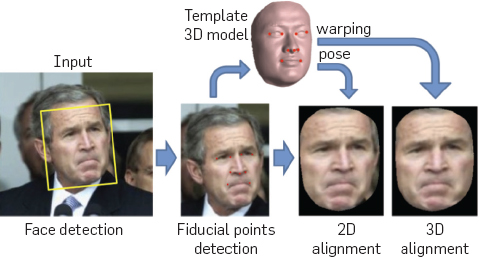
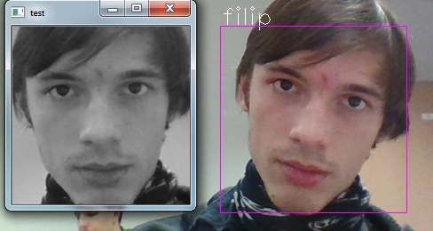
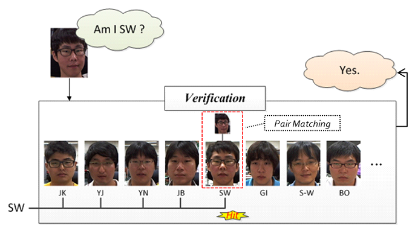
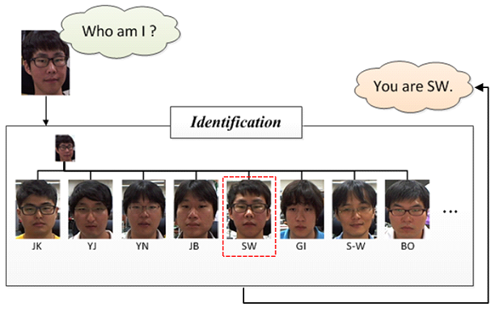
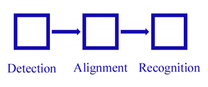
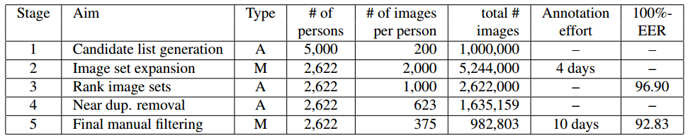
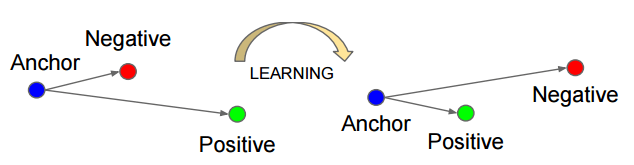
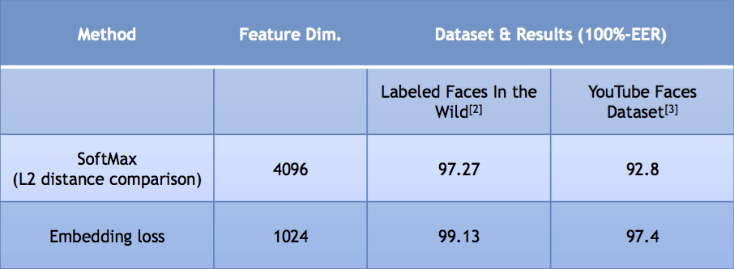

# DeepFace

---

## 基本概念

#### 人脸检测

Face detection, 对图像中的人脸进行检测，并将结果用矩形框框出来

#### 人脸对齐

Face alignment，对检测到的人脸进行姿态矫正，使其人脸尽可能的正，通过校正可以提高人脸识别的精度。校正的方法有2D校正、3D校正的方法，3D校正的方法可以使得侧脸得到较好的识别。目前校正在处理过程中完全可以达到实时性的要求，具体可以阅读Face Alignment at 3000 FPS via Regressing Local Binary Features这篇文章（[论文笔记](https://blog.csdn.net/boosting1/article/details/26085223))。在进行人脸校正的时候，会有检测特征点的位置这一步，这些特征点位置主要是诸如鼻子左侧，鼻孔下册，瞳孔位置，上嘴唇下册等等位置，知道了这些特征点的位置后，做一下位置驱动的变形，脸即可被校正了。下面两幅图像分别显示了原来的人脸和经过校正后的人脸。

#### 人脸校验

Face verification，人脸校验是基于pair matching的方式，所以他得到的答案‘是’或者‘不是’。在具体的操作的时候，给订一张测试图片，然后挨个进行pair matching，matching上了则说明测试图像与盖章图像上的人脸为同一个人的人脸。一般在小型办公室人脸刷脸打卡系统中采用的是这种方法，具体操作方法大概是这样得一个流程：离线逐个录入员工的人脸照片（一个员工录入的人脸一般不止一张），员工在刷脸打开的时候相机捕获到图像后，通过前面所讲的内容先进行人脸检测，再进行人脸对齐，再进行人脸校验，一旦match结果为“是”，说明该名刷脸的人员是属于本办公室的，人脸校验到这一步就算完成了。在离线录入员工人脸的时候，我们可以将人脸与人名对应，这样一旦在人脸校验成功后，就可以知道这个人是谁了。上面所说的这样一种系统的优点是开发费用低廉，适合小型办公场所，缺点是在捕获时不能有遮挡，而且还要求人脸姿态比较正。下图给出了示意说明，不过那个“Am I SW”应该改成“Am I the same to the seleted face image?"

#### 人脸识别

Face identification或者Face recognition, 人脸识别正如下图所示的，他要回答的是“我是谁？”，相对于人脸校验采用的pair matching,它在识别阶段更多的是采用分类的手段。他实际上是对进行了前面两步即人脸检测、人脸校正后做的图像（人脸）分类。

根据上面介绍的这4个概念，人脸识别包括下面的三个模块

## 人脸图像数据库
| Dataset | Identities | Images |
| ------- | ---------- | ------ |
| LFW     | 5749 | 133233 |
| WDRef | 2995 | 99773 |
| CelebFaces| 10177| 202599 |
| FaceBook | 4030 | 4.4M |
|Google|8M|200M|

## Deep Face Recognition

人脸识别按特征分类可以分为两种：

- 基于浅层特征的人脸识别
- 基于深度学习的人脸识别

Deep Face Recognition这篇文章做了两件事

- 介绍了一种抓取网络上图片并在有限的人力标注下得到一个大规模人脸图像的方法
- 测试了不同CNN网络结构下人脸校正以及度量学习对人脸识别的精度影响

#### 浅层人脸识别方法

首先提取人脸图像的局部特征，比如SIFT、LBP、HOG等特征，然后通过某种pooling机制将它们aggregate成全局人脸描述子，如Fisher Vector（可以参阅A compact and discriminative face track descriptor 和Fisher Vector Faces in the Wild这两篇文章）

#### 基于深度学习的人脸识别方法

通常使用CNN结构，比较典型的代码是DeepFace（DeepFace：Closing the gap to human-level performance in the face verification)，该方法使用一个深层的CNN网络结构，训练所使用的数据集数量为4百万，共包含4000个人脸。DeepFace在预处理的阶段使用了3D模型将人脸图像校准到典型姿态下。在当时DeepFace在LFW和在YFW人脸数据库上都取得了最好的结果。后来，文章的作者对其工作进行了拓展，其训练图库比原来的图库大了两个量级，包括100w个人的脸，每个identity有50张图像，他们通过一种自举策略来选择identities进行网络的训练，并说明可以通过控制全连接层的维度还提高网络的泛化能力。

DeepFace的工作后来被进一步拓展成了DeepId系列，具体可以阅读Y. Sun的4篇关于人脸识别的文章：

- Deep learning face representation by joint identificationverification,在分类和验证(virification)的时候使用多任务学习。
- Deep learning face representation from predicting 10,000 classes，将多个CNNs结构联合起来
- Deeply learned face representations are sparse, selective, and robust，在全连接层前面使用不同的CNN结构。
- Deepid3: Face recognition with very deep neural networks，使用更深的网络结构，大约用到了200个CNN结构，模型非常的复杂。

相比于DeepFace，DeepID没有使用3D的校准，而是使用了一种更简单的2D仿射校准，所用的训练图库是由CelebFaces和WDRef两个人脸图像库混合而成的。

在2015年谷歌的Facenet中，谷歌的研究人员使用了前面介绍的人脸图像库中的Google人脸数据库上去训练CNN网络，他们使用的是”triplet-based”损失，通过最小化类内差异和最大化类间差异，并在训练阶段将该损失应用在多层（不仅仅是最后一层），在LFW和YTF上获得了最好的识别成绩。

#### 人脸数据库搜集

1. **获取候选人名**。IMDB电影名人列表大约有500K个不同的人名，先从上面通过popularity排序获取到5k个人名，其中男女各占一半。这些人名通过不断地筛选排除，最后得到了2622个人名。
2. **为每一个人名搜集图片。**借助Google和Bing图片搜索引擎，分别按人名和人名actor两种方式进行查询，比如“Leonardo DiCaprio”和“Leonardo DiCaprio actor”，每次查询选前面500张，这样可以为每个人名获取到2000张图像。
3. **用自动filter提高纯度。**对于每一个基于Google查询的结果，将1前50个样本作为正样本，其他identity查询的前50个结果作为负样本，用Fisher Vector描述子训练一个one-vs-rest线性分类器。用这个线性分类器对每一个identity的2000个下载结果进行排序，保留前1000个结果。
4. **删除近似样本。**对没一幅图像计算其VLAD描述子，并对每一个identity的1000张图像进行聚类，经过这一步后，每个identity的图片数目为623个。文章在这一步说明操作的时候比较简略，比如聚类完后直接说“retaining  a single element per cluster"，个人觉得没讲清楚，按照我的理解应该是这么操作的：对每个identity的1000张图片聚类，聚类数目设置为623，聚类完成之后共623类，对每一类只保留跟那个类中心最近的图片，剔除掉该类的其他图片，这样每一个identity便得到了623张图片。
5. **最终的人工过滤。**这一步借助训练CNN网络来加速标注过程，具体操作按如下进行：选用AlexNet网络在这2622个identities上进行训练，然后用网络最后输出的softmax对么一个identity（此时的每一个identity包含有623张图片）进行降序排序，排序的依据是成为内点（按照我的理解这里的内点就是属于这个identity）的可能性，标注着按照排序的结果进行验证，最后获取了982903张较好的图片。

每个过程标注所花费的时间：

#### 网络结构与训练

在文章中，作者将其视为一个N=2622的分类问题，即每一个identity都是一类，选用的网络结构是vggNet，网络的最后一层是分类器 ***(W,b)***  去除，分数向量便可以作为特征通过计算欧氏距离进行人脸校验。上面得到的分数向量能够进一步得到完善，通过在欧式空间里面使用”triplet loss“的方式进行训练。其实这里所说使用”triplet loss“的方式进行训练是对特征的进一步精炼，使用的”triplet loss“讯息方法非常的常见，是度量学习的一种。

#### 使用triplet loss进行特征再学习

对于场面网络的输出分数向量 $\phi(l_t)\in R^D$, 对其进行$l_2$归一化，然后使用affine投影将其投影为$x_t = W'\phi(l_t)/ ||\phi(l_t)||_2$,其中$W'\in R^{L\times D}$,  W'为要求解得投影矩阵，W'通过triplet loss损失进行求解（也称作嵌入式学习，Embedding learning）：
$$
E(W') = \sum_{(a,p,n\in T)} max\{0, \alpha - ||X_a - X_n||_2^2 + ||X_a - X_p||_2^2\}, X_i = W' \frac{\phi(l_i)}{||\phi(l_i)||_2}
$$

上式中p是相对于a而言的正样本，n是相对于a而言的负样本，通过对该式进行优化，即可得到投影矩阵W，这样在秋的这个投影矩阵后，对上面网络输出的分数向量进行$L_2$归一化，再跟该投影矩阵W想成即可得到特征的最终表示。下表显示了在YFW人脸数据库上不进行特征在学习和进行特征在学习后的识别结果（特征在学习在下表中为Embedding learning）：

| No.  | Method                         | Images | NetWorks | 100%-EER | Acc. |
| ---- | ------------------------------ | ------ | -------- | -------- | ---- |
| 1    | Video FisherVector Faces       | -      | -        | 87.7     | 83.8 |
| 2    | DeepFace                       | 4M     | 1        | 91.4     | 91.4 |
| 3    | DeepID-2,2+,3                  |        | 200      | -        | 93.2 |
| 4    | FaceNet+Alignment              | 200M   | 1        | -        | 95.1 |
| 5    | Ours(K=100)                    | 2.6M   | 1        | 92.8     | 91.6 |
| 6    | Ours(K=100)+Embedding learning | 2.6M   | 1        | 97.4     | 97.3 |

从上表可以看到，Embedding learning将原来的91.6%的识别率提高到了97.3%。说明对网络输出的特征在学习（跟特征的fine-tune差不多的意思），可以提高精度。另外在Vgg Face Description项目主页上作者贴出了LFW和YFW两个人脸图像库上的识别率。

https://yongyuan.name/blog/deep-face-recognition-note.html