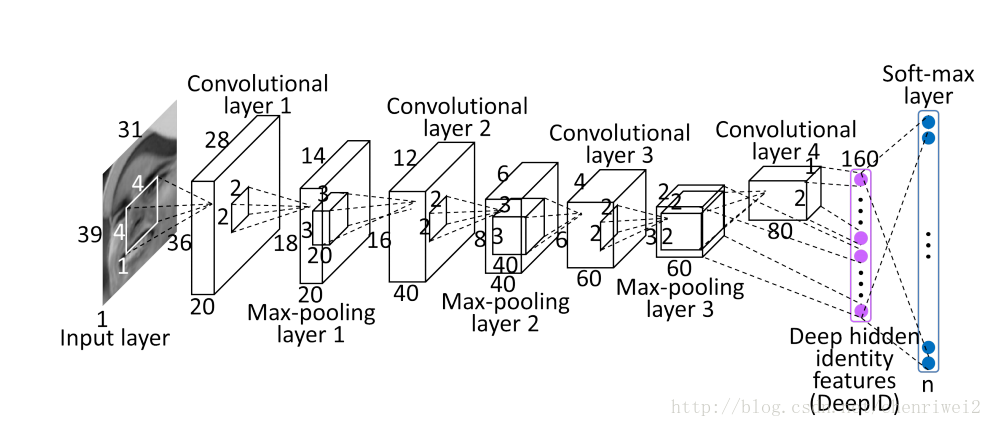
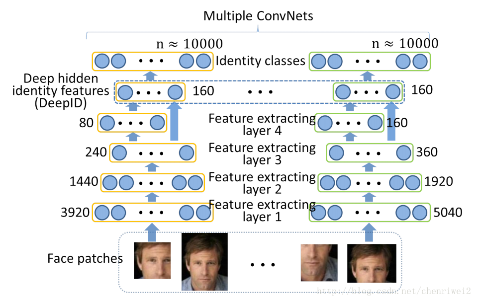

**Deep Learning Face Representation from Predicting 10,000 Classes**

主要内容:通过深度学习来进行图像高级特征表示（DeepID），进而进行人脸的分类。

---

**优点：**在人脸验证上面做，可以很好的扩展到其他的应用，并且夸数据库有效性；在数据库中的类别越多时，其泛化能力越强，特征比较少，不像其他特征好几K甚至上M，好的泛化能力+不过拟合于小的子训练集。

**结构：**包含4个卷积层提取特征，全连接层即deepid层(160个[神经元](https://www.baidu.com/s?wd=%E7%A5%9E%E7%BB%8F%E5%85%83&tn=24004469_oem_dg&rsv_dl=gh_pl_sl_csd)，由第三卷积层的max_pooling层和第四层卷积层得到),最后一层为softmax层分类层

**具体细节：**采用3个尺度，10个人脸region，60个patch，训练60个CNN网络，每个提取两个160维的特征（两个是因为： extracts two 160-dimensional DeepID vectors from a particular patch and its horizontally flipped counterpart.），所以最后一张人脸图像的特征的维度是：160\*2\*60=19200维。

