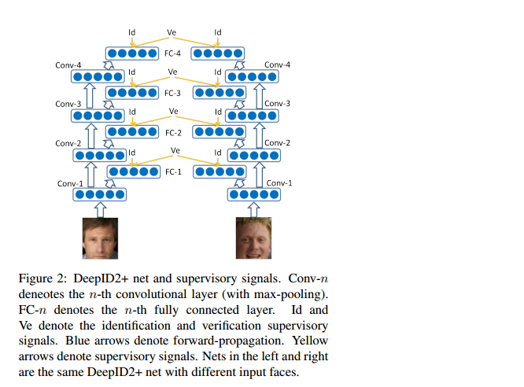

# DeepID2+

[Deeply learned face representations are sparse, selective, and robust](http://arxiv.org/pdf/1412.1265v1.pdf)

---

DeepID2+在DeepID2的基础上，继续对网络结构做了修改，同时增加了对卷积神经网络的分析，发现了几个特征：

- 适度稀疏，即使将神经元二值化后，认证效果依然很好
- 选择性，高层神经元对认证对象具有高度敏感性，对于同一个人很多神经元会持续保持激活或者抑制状态
- 鲁棒性，对于水平遮挡或者随机块遮挡，具有较高的鲁棒性，即使只剩额头和头发，依然可以达到88.2%的准确率

##### 1. 网络结构修改

DeepID2+继承了DeepID2的网络结构，并在低层网络添加了监督信号。

**改进：**

1. 每层卷积层增加到128个特征映射，最终产出512维特征（原始160维）
2. 训练数据集Merge了celebFaces+和WDRef数据集，总共290000副人脸图片，12000人
3. 在每个卷积层都增加了监督信息，不仅和第三层第四层和max-pool层连接，还连接了第一层和第二层的max-pool层的512维全连接实现。

##### 2. 适度稀疏和二值化

对于每张图片，大约半数的神经元是激活状态的，对于一个神经元，大约在半数的图片中是激活态的。

##### 3.特征的选择性

一个类或者属性的重要与否取决于神经元状态的激活于抑制，比如一个神经元在遇到George Bush时时激活状态，但是看到Colin Powell就变成抑制状态了。对于每个神经元，通过统计它的直方图可以看出有半数的激活态是0，其他则对应很大的数值，也就是说对弈特定的类型，神经元对于某些特征有很强的选择性。

##### 4.鲁棒性

对鲁棒性的实验采用两种遮挡，一种是从下向上的遮挡，从10-70%的遮挡；一种是随机块的遮挡，遮挡尺寸从10x10 ~ 70x70。

