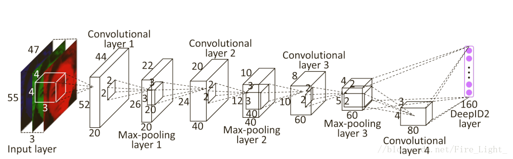
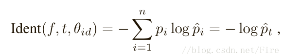
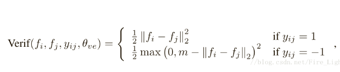
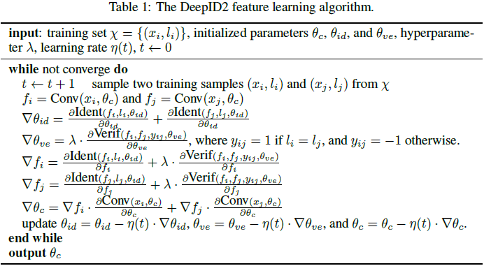
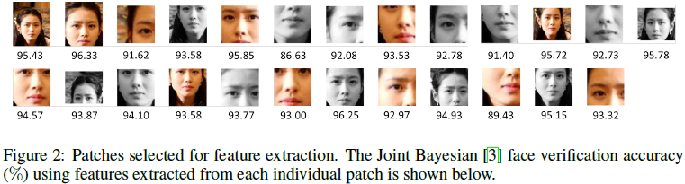
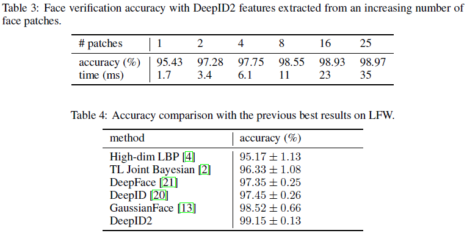

# DeepID2

Deep Learning Face Representation by Joint Identification-Verification

---

人脸识别的关键挑战是开发有效的特征表示以减少类内变化，增大类间变化。作者同事使用face identification 和 verification 信号进行监督学习。face identification增大类间的变化，face verification减少类内变化。在LFW数据库上得到了99.15%的人脸确认率。

**网络结构**

网络结构类似DeepID1，不同之处在于使用了两种不同的损失函数。

DeepID2 layer的输入是有Pool3和Conv4共同组成的。这里需要注意DeepID2与DeepID1的一个重要区别是Loss函数的形式。DeepID1的Loss函数即SoftmaxLoss,DeepID2的Loss包括两个部分：SoftmaxLoss和L2/L1 Loss，即文中提到的识别Loss和验证Loss，具体形式如下所示：

#### 损失函数

**分类信号**：

训练过程中有两个监督信号，一个是人脸识别信号，以身份作为类别将人脸图像分到其中一类中，使用softmax层实现，输出属于每一类的概率。为了准确分类，该信号促使网络学习身份相关的区别特征，使类间间隔加大。

**验证信号：**

另一个是人脸验证信号，促使从相同身份的人脸图像上学习到的特征更相似，使类内误差减小。普遍采用的方法是L1/L2范式和余弦相似度，而文中采用一种基于L2范式的损失函数，fi和fj表示两个人脸图像的特征，y=1表示同一身份，y=-1表示不同身份，不同身份时距离需要大于边界m：

#### 训练流程

#### 人脸验证

整个测试流程为人脸对齐、特征提取和人脸验证，使用[SDM](https://www.cnblogs.com/cv-pr/p/4797823.html)获得21点进行对齐，然后裁剪200个人脸patches，包含不同的位置、尺度、颜色通道等，水平翻转得400个patches。使用200个上述的卷积网络分别去提取特征向量，每个卷积网路得到2x160维的特征（加上水平翻转后的图像块）。为减少特征冗余，使用一种前项-后向贪婪算法，去选择高效完备的图像块及其网络，文中采用的个数为25，如上figure2所示。则这25个图像块，分别通过其对应网络获得160维特征，则一张人脸图像得到的特征向量长度为4000=25x160，然后通过PCA降维至180，基于该特征向量训练联合贝叶斯分类器。

#### 实验结果

为充分利用从大量图像块中提取到的特征，作者重复使用7次上面提到的前项-后向贪婪算法选取特征，每次的选择是从之前的选择中未被留下的部分中进行选取。然后在每次选择的特征上训练联合贝叶斯模型，然后再将这七个联合贝叶斯模型使用SVM进行融合，得到最佳的效果在LFW上为99.15%。

