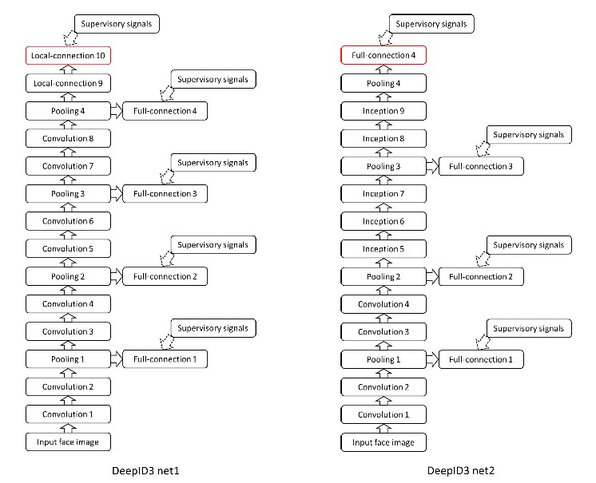

# DeepID3

Face recognition with very deep neural networks

---

#### 网络结构

DeepID3有两种不同的结构，分别为DeepID3 net1 和 DeepID3 net2。相对于DeepID2+，他的层数更多，网络更深。同事很节俭了VGG net和GoogLeNet，引入了inception layer，这个主要是用在DeepID3 net2里面。网络中还出现了连续两个conv layer直接相连的情况，这样使得网络具有更大的receptive fields和更复杂的二nonlinearity，同时还能限制参数的数量。

