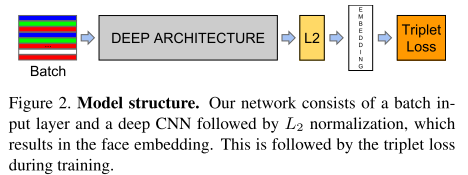

# FaceNet

FaceNet- A Unified Embedding for Face Recognition and Clustering

---

FaceNet是一个通用的系统，可以用于人脸验证（是否是同一人？），识别（这个人是谁？）和聚类（寻找类似的人？）。FaceNet采用的方法是通过卷积神经网络学习将图像映射到欧几里得空间。空间距离直接和图片相似度相关：同一个人的不同图像在空间距离很小，不同人的图像在空间中有较大的距离。只要该映射确定下来，相关的人脸识别任务就变得很简单。

当前存在的基于深度神经网络的人脸识别模型使用了分类层（classification layer）：中间层为人脸图像的向量映射，然后以分类层作为输出层。这类方法的弊端是不直接和效率低。

FaceNet并没有用传统的softmax的方式去进行分类学习，然后抽取其中某一层作为特征，而是直接进行端对端学习一个从图像到欧式空间的编码方法，然后基于这个编码再做人脸识别、人脸验证和人脸聚类等。

FaceNet直接使用基于triplets的LMNN（最大边界近邻分类）的loss函数训练神经网络，网络直接输出为128维度的向量空间。我们选取的triplets（三联子）包含两个匹配脸部缩略图和一个非匹配的脸部缩略图，loss函数目标是通过距离边界区分正负类，如图所示

## 目标函数

Google直接替换了softmax

所谓的三元组就是三个样例，如（anchor，pos，neg），其中，x和p是同一类，x和n是不同类。学习的过程就是学到一种表示，对于尽可能多的三元组，使得anchor和pos的距离小于anchor和neg的距离，即：
$$
||x_i^a - x_i^p||_2^2 + \alpha < ||x_i^a - x_i^n||_2^2, \forall(x_i^a,x_i^p,x_i^n) \in \tau
$$
所以，变换一下，等到目标函数：
$$
\sum_i^N[||f(x_i^a) - f(x_i^p)||_2^2 - ||f(x_i^a) - f(x_i^n)||_2^2 + \alpha]_+
$$
目标函数的含义就是对于不满足条件的三元组进行优化；对于满足条件的三元组，就pass先不管

## 三元组的选择

很少的数据就可以产生很多的三元组，如果三元组选的不得法，那么模型要很久很久才能收敛。因而，三元组的选择特别重要。

当然最暴力的方法就是对于每个样本，从所有样本中找出离他最近的返利和离他最远的正例，然后进行优化。这种方法有两个弊端：

- 耗时，基本上选三元组要比训练还要耗时
- 容易受不好的数据的主导得到的模型会很差

所以为了解决上述问题，论文中提出了两种策略：

- 每N步在数据的子集上生成一些triplet
- 在线生成triplet，在每个mini-batch中选择hard pos/neg样例。

为了使mini-batch中生成的triplet合理，生成mini-batch的时候，保证每个mini-batch中每个人平均有40张图片。然后随机加一些反例进去。在生成triplet的时候找出所有的anchor-pos对，然后对每个anchor-pos对找出其hard neg样本。这里，并不是严格的去找hard的anchor-pos对，找出所有的anchor-pos对训练的收敛速度也很快。

除了上述策略外，还可能会选择一些semi-hard的样例，所谓的semi-hard即不考虑alpha因素，即：
$$
||f(x_i^a) - f(x_i^p)||_2^2 < ||f(x_i^a) - f(x_i^n)||_2^2
$$

## 网络模型

论文中使用了两种卷积模型：

- 第一种是Zeiler&Ferguas架构，22层，140M参数，1.6billion FlOPS（FLOPS是什么？）称之为NN1
- 第二种是GoogleNet式的Inception模型。模型参数是第一个的20分之一，FLOPS是第一个的五分之一。
- 基于Inception模型，减小模型大小，形成两个小模型
  - NNS1：26M参数，220M FLOPS。
  - NNS2：4.3M参数，20M FLOPS。
- NN3与NN4和NN2结构一样，但输入变小了。 
  - NN2原始输入：224×224
  - NN3输入：160×160
  - NN4输入：96×96

其中NNS模型可以在手机上运行。