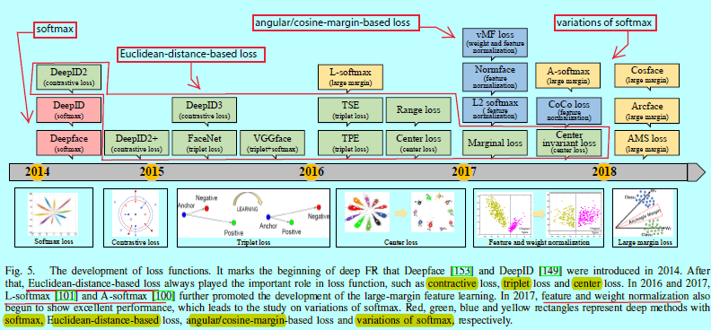
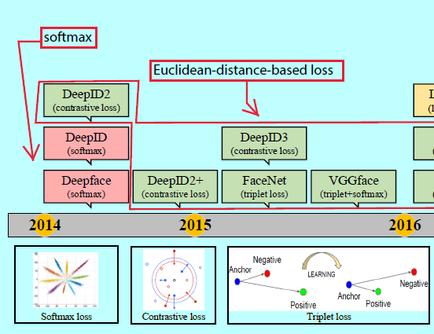
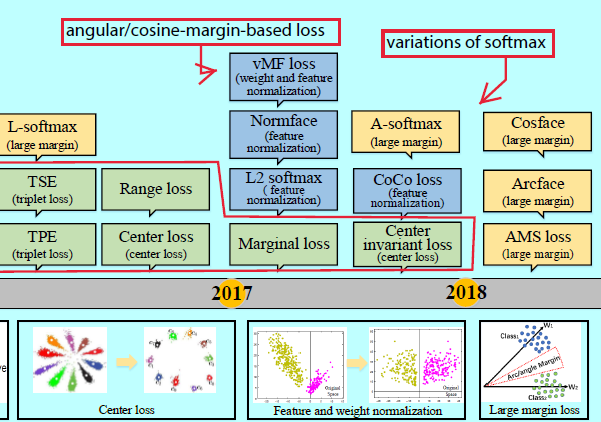

# 人脸识别综述

face recognition\[翻译\][深度人脸识别:综述](<https://www.cnblogs.com/shouhuxianjian/p/9789243.html>)

---

## 判别性损失函数的演变

从目标分类网络发展至今，如alexnet，最开始的FR网络如Deepface[153]和DeepID[149]都是采用基于softmax loss的交叉时进行特征学习的。然后人们发现softmax不足以去学习有大边际的特征，所以更多的研究者开始利用判别性损失函数去增强泛化能力。这也变成了深度FR研究中最火热的研究点

