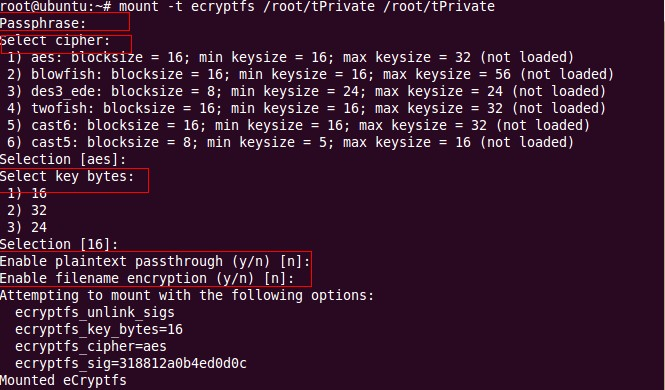

# eCryptfs

eCryptFS（Enterprise Cryptographic Filesystem）可翻译为企业级文件加密系统，是Linux系统中的文件加密系统，能够对文件或目录进行加密，且加密级别高，安全性强于一般软件。

---
## 安装eCryptfs

```bash
sudo apt-get install ecryptfs-utils
```

## 加密目录

- **创建一个加密目录**

  ```bash
  mkdir -p /disk2/.Private
  chmod 755 /disk2/.Private
  ```

- **以ecryptfs类型挂在目录**

  ```bash
  sudo mount -t ecryptfs /disk2/.Private /disk2
  ```
  
  
  
  **<span style="color:red;">注意：一定要记住Passphrase、cipher和key bytes</span>**


## 卸载目录

```bash
	sudo umount /disk2
```

卸载目录之后原始的文件读取不了，该文件夹只有正确重新挂载之后才能够正常读写。


## eCryptfs 不足之处

1. 写操作性能比较差。笔者用 iozone 测试了 eCryptfs 的性能，发现读操作的开销不算太大，最多降低 29%，有些小文件测试项目反而性能更好；对于写操作，所有测试项目的结果都很差，普遍下降 16 倍左右。这是因为 Page Cache 里面只存放明文，因此首次数据的读取需要解密操作，后续的读操作没有开销；而每一次写 x 字节的数据，就会涉及 ((x – 1) / extent_size + 1) * extent_size 字节的加密操作，因此开销比较大。
2. 有两种情况可能造成信息泄漏：a. 当系统内存不足时，Page Cache 中的加密文件的明文页可能会被交换到 swap 区，目前的解决方法是用 dm-crypt 加密 swap 区。b. 应用程序也有可能在读取加密文件后，将其中某些内容以临时文件的方式写入未挂载 eCryptfs 的目录中（比如直接写到 /tmp 中），解决方案是配置应用程序或修改其实现。
3. eCryptfs 实现的安全性完全依赖于操作系统自身的安全。如果 Linux Kernel 被攻陷，那么黑客可以轻而易举地获得文件的明文，FEK 等重要信息。

  